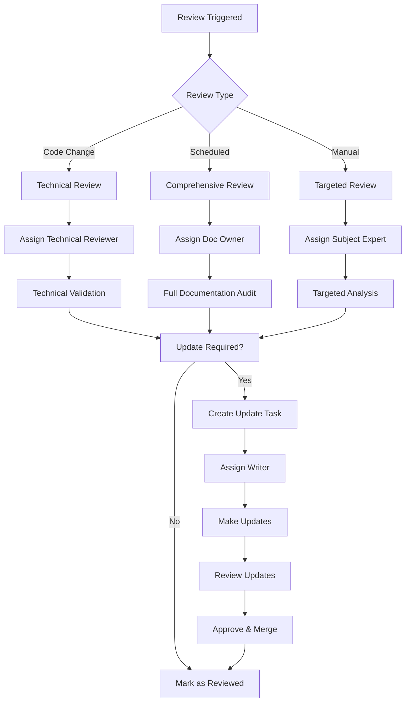
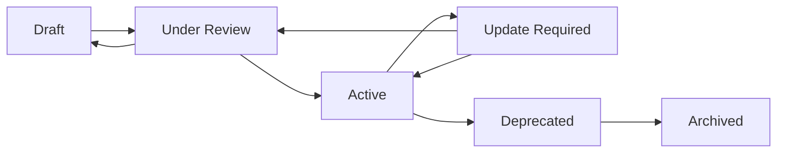

# Document Governance Framework

## Overview

This document establishes the governance framework for maintaining, reviewing, and updating all project documentation. It ensures documentation remains accurate, current, and valuable for development teams and stakeholders.

## Document Review Workflows

### 1. Review Triggers

Documentation reviews are triggered by the following events:

#### Automatic Triggers
- **Code Changes**: Any PR affecting documented components
- **Feature Completion**: When stories/epics are marked complete
- **Architecture Changes**: Modifications to system design
- **API Changes**: Updates to public interfaces
- **Deployment Changes**: Infrastructure or deployment process updates

#### Scheduled Triggers
- **Quarterly Reviews**: Comprehensive documentation audit
- **Release Reviews**: Before major version releases
- **Annual Reviews**: Strategic documentation planning

#### Manual Triggers
- **Stakeholder Request**: When documentation gaps are identified
- **Developer Feedback**: When docs are reported as outdated
- **New Team Members**: When onboarding reveals doc issues

### 2. Review Process Flow



### 3. Review Assignments

#### Technical Reviews (Code-Triggered)
- **Reviewer**: Original PR author or technical lead
- **Timeline**: Within 2 business days of PR merge
- **Scope**: Documents related to changed code
- **Outcome**: Update tasks or approval

#### Comprehensive Reviews (Scheduled)
- **Reviewer**: Documentation owner + subject matter experts
- **Timeline**: Quarterly (Q1, Q2, Q3, Q4)
- **Scope**: All documentation
- **Outcome**: Documentation roadmap and update tasks

#### Targeted Reviews (Manual)
- **Reviewer**: Assigned based on document type
- **Timeline**: Within 1 week of trigger
- **Scope**: Specific document or section
- **Outcome**: Immediate fixes or update tasks

## Review Templates and Checklists

### 1. Technical Review Template

```markdown
# Technical Documentation Review

**Document**: [Document Name]
**Reviewer**: [Reviewer Name]
**Date**: [Review Date]
**Trigger**: [What triggered this review]

## Review Checklist

### Accuracy
- [ ] Code examples are current and functional
- [ ] API documentation matches implementation
- [ ] Architecture diagrams reflect current state
- [ ] Configuration examples are valid

### Completeness
- [ ] All new features are documented
- [ ] Breaking changes are noted
- [ ] Migration guides are provided (if applicable)
- [ ] Dependencies are up to date

### Clarity
- [ ] Instructions are clear and actionable
- [ ] Examples are relevant and helpful
- [ ] Terminology is consistent
- [ ] Prerequisites are clearly stated

## Findings

### Issues Identified
1. [Issue 1 - Priority/Category]
2. [Issue 2 - Priority/Category]

### Recommendations
1. [Recommendation 1]
2. [Recommendation 2]

### Action Items
- [ ] [Action 1 - Assignee - Due Date]
- [ ] [Action 2 - Assignee - Due Date]

**Review Status**: [Approved/Needs Updates/Major Revision Required]
```

### 2. Comprehensive Review Template

```markdown
# Comprehensive Documentation Review

**Quarter**: [Q1/Q2/Q3/Q4 YYYY]
**Reviewer**: [Primary Reviewer]
**Review Team**: [List of reviewers]
**Date Range**: [Start Date] - [End Date]

## Documentation Inventory

### Core Documentation
- [ ] README.md - Last Updated: [Date] - Status: [Good/Needs Update/Outdated]
- [ ] Architecture Documentation - Last Updated: [Date] - Status: [Status]
- [ ] API Documentation - Last Updated: [Date] - Status: [Status]
- [ ] Development Guides - Last Updated: [Date] - Status: [Status]
- [ ] Deployment Documentation - Last Updated: [Date] - Status: [Status]

### Package-Specific Documentation
- [ ] cube-engine/docs/ - Status: [Status]
- [ ] three-renderer/docs/ - Status: [Status]
- [ ] web-app/docs/ - Status: [Status]
- [ ] shared/docs/ - Status: [Status]
- [ ] api-server/docs/ - Status: [Status]

## Review Areas

### 1. Content Quality
- **Accuracy**: How well docs match current implementation
- **Completeness**: Coverage of all features and functionality
- **Clarity**: Ease of understanding for target audience
- **Organization**: Logical structure and navigation

### 2. Maintenance Health
- **Update Frequency**: How often docs are updated
- **Ownership**: Clear responsibility assignments
- **Version Control**: Proper tracking of changes
- **Automation**: Automated validation where possible

### 3. User Experience
- **Discoverability**: Can users find what they need?
- **Usability**: Are instructions followable?
- **Feedback**: What are users reporting?
- **Gaps**: What's missing that users need?

## Findings Summary

### High Priority Issues
1. [Issue 1 - Impact - Assigned To]
2. [Issue 2 - Impact - Assigned To]

### Medium Priority Issues
1. [Issue 1 - Impact - Assigned To]
2. [Issue 2 - Impact - Assigned To]

### Recommendations for Next Quarter
1. [Strategic Recommendation 1]
2. [Strategic Recommendation 2]

## Action Plan

### Immediate Actions (This Sprint)
- [ ] [Action 1 - Owner - Due Date]
- [ ] [Action 2 - Owner - Due Date]

### Short-term Actions (This Quarter)
- [ ] [Action 1 - Owner - Due Date]
- [ ] [Action 2 - Owner - Due Date]

### Long-term Actions (Next Quarter)
- [ ] [Action 1 - Owner - Due Date]
- [ ] [Action 2 - Owner - Due Date]
```

## Maintenance Checklists

### 1. Daily Maintenance Checklist

```markdown
# Daily Documentation Maintenance

**Date**: [Date]
**Maintainer**: [Name]

## Automated Checks
- [ ] Documentation build successful
- [ ] Link checker passed
- [ ] Spell check passed
- [ ] Code example validation passed

## Manual Checks
- [ ] Review new issues/feedback about documentation
- [ ] Check for documentation-related PRs
- [ ] Review any documentation update requests
- [ ] Monitor documentation usage metrics

## Actions Taken
- [List any actions taken]

**Status**: [All Clear/Issues Found/Actions Required]
```

### 2. Weekly Maintenance Checklist

```markdown
# Weekly Documentation Maintenance

**Week of**: [Date Range]
**Maintainer**: [Name]

## Content Review
- [ ] Review documentation feedback from past week
- [ ] Check for outdated "last updated" dates
- [ ] Validate recently changed code examples
- [ ] Review documentation analytics/usage data

## Process Review
- [ ] Check pending documentation update tasks
- [ ] Review documentation-related support tickets
- [ ] Assess documentation workflow effectiveness
- [ ] Plan upcoming documentation work

## Stakeholder Communication
- [ ] Send weekly documentation status to team
- [ ] Highlight any critical documentation issues
- [ ] Share documentation usage insights

## Actions for Next Week
- [List planned actions]

**Overall Health**: [Green/Yellow/Red]
```

### 3. Monthly Maintenance Checklist

```markdown
# Monthly Documentation Maintenance

**Month**: [Month Year]
**Maintainer**: [Name]

## Comprehensive Health Check
- [ ] Full documentation inventory
- [ ] Link validation across all docs
- [ ] Content freshness analysis
- [ ] User feedback analysis

## Process Evaluation
- [ ] Review documentation update velocity
- [ ] Assess review process effectiveness
- [ ] Evaluate maintenance overhead
- [ ] Check documentation ownership assignments

## Strategic Planning
- [ ] Plan next month's documentation priorities
- [ ] Identify emerging documentation needs
- [ ] Review documentation tooling effectiveness
- [ ] Plan any process improvements

## Reporting
- [ ] Generate monthly documentation health report
- [ ] Share insights with stakeholders
- [ ] Update documentation roadmap

**Monthly Status**: [Excellent/Good/Needs Attention/Critical Issues]
```

## Update Triggers and Responsibilities

### 1. Responsibility Matrix (RACI)

| Document Type | Writer | Technical Reviewer | Approver | Informed |
|---------------|--------|-------------------|----------|----------|
| API Documentation | Dev Team (R) | Tech Lead (A) | Architect (C) | PO (I) |
| Architecture Docs | Architect (R) | Senior Dev (C) | Tech Lead (A) | All (I) |
| User Guides | Tech Writer (R) | Dev Team (C) | PO (A) | Users (I) |
| Development Setup | Dev Team (R) | DevOps (C) | Tech Lead (A) | All Devs (I) |
| Deployment Guides | DevOps (R) | Architect (C) | Tech Lead (A) | Dev Team (I) |

**Legend**: R = Responsible, A = Accountable, C = Consulted, I = Informed

### 2. Update Trigger Automation

#### Git Hook Integration

```bash
#!/bin/bash
# .git/hooks/post-merge
# Documentation update trigger

# Check if documented files were changed
CHANGED_FILES=$(git diff --name-only HEAD~1 HEAD)

# Define patterns that trigger doc updates
PATTERNS=(
    "packages/*/src/"
    "packages/*/package.json"
    "docs/architecture/"
    "README.md"
    "CLAUDE.md"
)

# Check each pattern
for pattern in "${PATTERNS[@]}"; do
    if echo "$CHANGED_FILES" | grep -q "$pattern"; then
        echo "Documentation update may be needed for changes in: $pattern"
        # Create GitHub issue or send notification
        curl -X POST \
            -H "Authorization: token $GITHUB_TOKEN" \
            -H "Content-Type: application/json" \
            -d "{
                \"title\": \"Documentation Update Required\",
                \"body\": \"Changes detected in $pattern may require documentation updates.\",
                \"labels\": [\"documentation\", \"maintenance\"]
            }" \
            "https://api.github.com/repos/$REPO/issues"
    fi
done
```

#### GitHub Actions Workflow

```yaml
# .github/workflows/doc-maintenance.yml
name: Documentation Maintenance

on:
  schedule:
    - cron: '0 9 * * MON'  # Every Monday at 9 AM
  push:
    paths:
      - 'packages/*/src/**'
      - 'docs/**'
      - 'README.md'
      - 'CLAUDE.md'

jobs:
  check-documentation:
    runs-on: ubuntu-latest
    steps:
      - uses: actions/checkout@v3
      
      - name: Check for outdated documentation
        run: |
          # Check for files older than 30 days
          find docs/ -name "*.md" -mtime +30 -exec echo "Potentially outdated: {}" \;
          
      - name: Validate links
        run: |
          # Install and run link checker
          npm install -g markdown-link-check
          find . -name "*.md" -exec markdown-link-check {} \;
          
      - name: Create maintenance issue
        if: failure()
        uses: actions/github-script@v6
        with:
          script: |
            github.rest.issues.create({
              owner: context.repo.owner,
              repo: context.repo.repo,
              title: 'Weekly Documentation Maintenance Required',
              body: 'Automated checks found documentation issues that need attention.',
              labels: ['documentation', 'maintenance', 'automated']
            });
```

### 3. Notification System

#### Slack Integration

```bash
# Send documentation alerts to Slack
send_doc_alert() {
    local message="$1"
    local channel="#documentation"
    local webhook_url="$SLACK_WEBHOOK_URL"
    
    curl -X POST -H 'Content-type: application/json' \
        --data "{\"channel\":\"$channel\",\"text\":\"📚 Documentation Alert: $message\"}" \
        "$webhook_url"
}

# Usage examples
send_doc_alert "API documentation needs update after v2.1.0 release"
send_doc_alert "Architecture document is 60 days old - review recommended"
```

## Document Ownership and Lifecycle

### 1. Document Ownership Registry

```markdown
# Document Ownership Registry

| Document | Primary Owner | Secondary Owner | Subject Matter Expert | Review Frequency |
|----------|---------------|-----------------|----------------------|------------------|
| README.md | Tech Lead | Product Owner | Architect | Monthly |
| docs/architecture/ | Architect | Senior Dev | Tech Lead | Quarterly |
| docs/api/ | Backend Lead | API Developer | Tech Lead | Per Release |
| docs/LOCAL_DEVELOPMENT.md | DevOps | Senior Dev | Tech Lead | Monthly |
| docs/PERFORMANCE_OPTIMIZATION.md | Performance Engineer | Senior Dev | Architect | Quarterly |
| packages/*/docs/API.md | Package Maintainer | Tech Lead | Domain Expert | Per Feature |
```

### 2. Document Lifecycle States

#### State Definitions
- **Draft**: Initial creation, not yet reviewed
- **Under Review**: Currently being reviewed
- **Active**: Approved and current
- **Update Required**: Needs updates but still usable
- **Deprecated**: No longer maintained, replacement exists
- **Archived**: Historical reference only

#### State Transitions



### 3. Documentation Metrics and KPIs

#### Quality Metrics
- **Freshness**: Average age of documentation
- **Accuracy**: Percentage of docs validated as current
- **Completeness**: Coverage of features/functionality
- **Usability**: User feedback scores

#### Usage Metrics
- **Page Views**: Most/least accessed documentation
- **Search Queries**: What users are looking for
- **Feedback Scores**: User satisfaction ratings
- **Support Tickets**: Documentation-related issues

#### Process Metrics
- **Update Velocity**: Time from trigger to update
- **Review Completion**: Percentage of reviews completed on time
- **Issue Resolution**: Time to resolve documentation issues
- **Ownership Coverage**: Percentage of docs with assigned owners

## Implementation Plan

### Phase 1: Foundation (Week 1-2)
1. Set up document ownership registry
2. Create initial review templates
3. Establish notification systems
4. Train team on new processes

### Phase 2: Automation (Week 3-4)
1. Implement git hooks
2. Set up GitHub Actions workflows
3. Configure Slack integrations
4. Create automated health checks

### Phase 3: Optimization (Week 5-6)
1. Collect initial metrics
2. Refine processes based on feedback
3. Optimize automation workflows
4. Establish regular reporting

### Phase 4: Maintenance (Ongoing)
1. Regular process reviews
2. Continuous improvement
3. Metric analysis and optimization
4. Team training and updates

## Success Criteria

- All documentation has assigned owners
- Review processes are followed consistently
- Update triggers are automated and effective
- Documentation stays current with codebase
- Team satisfaction with documentation quality improves
- Onboarding time for new developers decreases
- Support tickets related to documentation decrease