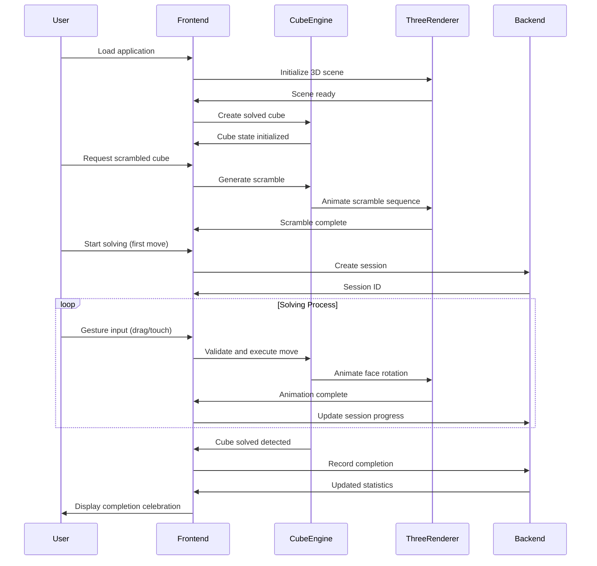
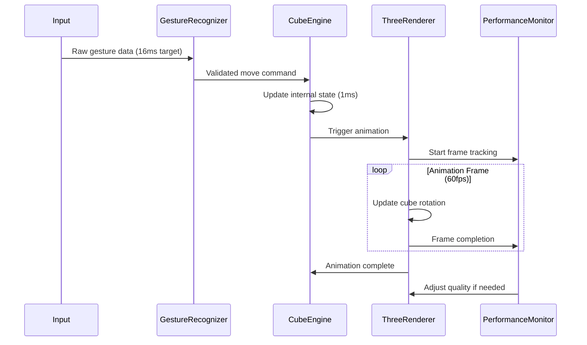

# 8. Core Workflows

## Primary User Journey: Cube Solving Session

```mermaid
sequenceDiagram
    participant User
    participant Frontend
    participant CubeEngine
    participant ThreeRenderer
    participant Backend

    User->>Frontend: Load application
    Frontend->>ThreeRenderer: Initialize 3D scene
    ThreeRenderer->>Frontend: Scene ready
    Frontend->>CubeEngine: Create solved cube
    CubeEngine->>Frontend: Cube state initialized
    
    User->>Frontend: Request scrambled cube
    Frontend->>CubeEngine: Generate scramble
    CubeEngine->>ThreeRenderer: Animate scramble sequence
    ThreeRenderer->>Frontend: Scramble complete
    
    User->>Frontend: Start solving (first move)
    Frontend->>Backend: Create session
    Backend->>Frontend: Session ID
    
    loop Solving Process
        User->>Frontend: Gesture input (drag/touch)
        Frontend->>CubeEngine: Validate and execute move
        CubeEngine->>ThreeRenderer: Animate face rotation
        ThreeRenderer->>Frontend: Animation complete
        Frontend->>Backend: Update session progress
    end
    
    CubeEngine->>Frontend: Cube solved detected
    Frontend->>Backend: Record completion
    Backend->>Frontend: Updated statistics
    Frontend->>User: Display completion celebration
```

## Critical Performance Flow: Move Execution

```mermaid
sequenceDiagram
    participant Input
    participant GestureRecognizer
    participant CubeEngine
    participant ThreeRenderer
    participant PerformanceMonitor

    Input->>GestureRecognizer: Raw gesture data (16ms target)
    GestureRecognizer->>CubeEngine: Validated move command
    CubeEngine->>CubeEngine: Update internal state (1ms)
    CubeEngine->>ThreeRenderer: Trigger animation
    ThreeRenderer->>PerformanceMonitor: Start frame tracking
    
    loop Animation Frame (60fps)
        ThreeRenderer->>ThreeRenderer: Update cube rotation
        ThreeRenderer->>PerformanceMonitor: Frame completion
    end
    
    ThreeRenderer->>CubeEngine: Animation complete
    PerformanceMonitor->>ThreeRenderer: Adjust quality if needed
```

---
