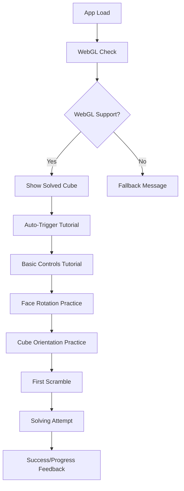
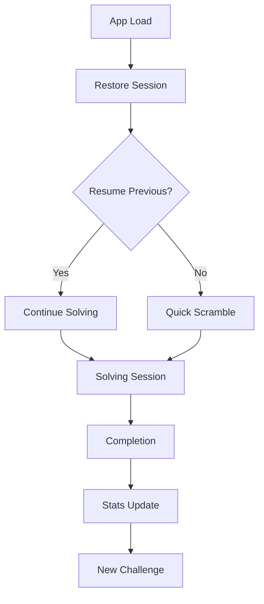
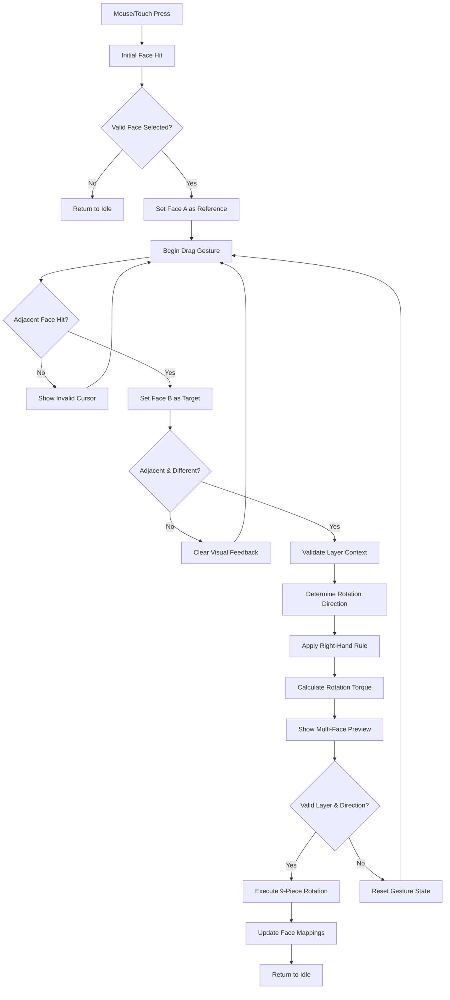

# 3D Rubik's Cube Game - UX/UI Architecture Specification

## Executive Summary

This document defines the comprehensive user experience architecture for the 3D Rubik's Cube Game, translating the PRD requirements into actionable design specifications. The architecture prioritizes intuitive 3D interaction, cross-platform performance, and progressive learning while maintaining 60fps performance targets.

## 1. UX Vision & Design Principles

### Core UX Vision
Create an immersive, tactile-feeling digital experience that rivals physical cube manipulation through:
- **Natural 3D Interaction**: Gestures feel like touching a real cube
- **Visual Clarity**: 3D cube dominates with minimal UI interference
- **Progressive Mastery**: Learning path from novice to expert
- **Universal Access**: Consistent experience across all devices and abilities

### Design Principles

**1. Direct Manipulation First**
- Every interaction should feel like touching the cube directly
- No mode switching or complex control schemes
- Immediate visual feedback for all actions

**2. Performance as User Experience**
- 60fps is non-negotiable for maintaining immersion
- Visual design decisions prioritize frame rate over aesthetics
- Progressive enhancement based on device capabilities

**3. Progressive Disclosure**
- Interface complexity grows with user expertise
- Advanced features hidden until contextually relevant
- Tutorial system adapts to user progress

**4. Inclusive Design**
- WCAG AA compliance from day one
- Multiple input methods for same actions
- Works across diverse devices and network conditions

## 2. Information Architecture

### Primary Views Hierarchy

```
Main Application
├── Game View (Primary)
│   ├── 3D Cube Canvas (Full screen)
│   ├── Minimal UI Overlay
│   │   ├── Timer/Moves Display
│   │   ├── Quick Actions (Reset, Scramble)
│   │   └── Settings Access
│   └── Contextual Help System
├── Tutorial Overlay System
│   ├── Introduction Flow
│   ├── Control Learning
│   ├── Notation Guide
│   └── Solving Methods
├── Settings Panel (Slide-out)
│   ├── Difficulty Settings
│   ├── Visual Preferences
│   ├── Accessibility Options
│   └── Performance Settings
└── Statistics Modal
    ├── Session Stats
    ├── Personal Records
    └── Progress Tracking
```

### Content Priority Matrix

| Priority | Desktop | Tablet | Mobile |
|----------|---------|---------|---------|
| **Critical** | 3D Cube, Basic Controls | 3D Cube, Touch Controls | 3D Cube, Simplified Controls |
| **Important** | Timer/Stats, Tutorial Access | Timer/Stats, Settings | Timer Display |
| **Optional** | Advanced Stats, Hints | Hints System | Quick Reset |
| **Hidden** | Debug Info, Performance | Debug Info | Advanced Settings |

## 3. User Flow Architecture

### Primary User Journey: First-Time Experience



### Secondary Flow: Expert User Session



### Enhanced Face-to-Face Gesture Flow



## 4. Responsive Layout System

### Breakpoint Strategy

**Mobile First Approach with Performance Scaling**

```css
/* Mobile: 320-767px */
.cube-container {
  viewport: 100vh - 60px; /* Account for browser UI */
  controls: touch-optimized;
  ui-density: minimal;
  performance: reduced-quality;
}

/* Tablet: 768-1023px */
.cube-container {
  viewport: 80vh;
  controls: touch + gesture;
  ui-density: standard;
  performance: medium-quality;
}

/* Desktop: 1024px+ */
.cube-container {
  viewport: 70vh;
  controls: mouse + keyboard;
  ui-density: full;
  performance: high-quality;
}
```

### Layout Grid System

**Desktop Layout (1024px+)**
```
┌─────────────────────────────────────┐
│ [Settings] [Timer: 00:45] [Moves: 23] │ 60px header
├─────────────────────────────────────┤
│                                     │
│            3D CUBE CANVAS           │ Main area
│              (720x720)              │ Square aspect
│                                     │
├─────────────────────────────────────┤
│ [Reset] [Scramble] [Hint] [Help]    │ 60px footer
└─────────────────────────────────────┘
```

**Mobile Layout (320-767px)**
```
┌─────────────────┐
│ ⚙️  00:45  23   │ 50px compact header
├─────────────────┤
│                 │
│   3D CUBE       │ Square, fills width
│   (300x300)     │ Touch optimized
│                 │
├─────────────────┤
│ 🔄 🎲 💡       │ 44px icon bar
└─────────────────┘
```

## 5. Gesture Recognition & Interaction Patterns

### Input Method Hierarchy

**Desktop Mouse Controls**
- **Primary**: Left click + drag for face rotation
- **Secondary**: Right click + drag for cube orientation
- **Tertiary**: Mouse wheel for zoom
- **Modifier**: Shift + actions for advanced modes

**Mobile Touch Controls**
- **Primary**: Single finger drag for face rotation
- **Secondary**: Two finger drag for cube orientation  
- **Tertiary**: Pinch for zoom
- **Long Press**: Context menu access

### Detailed Face-to-Face Drag Interaction Logic

#### Core Interaction Pattern:
- **Face Selection:** Initial mouse/touch press selects a cube face as reference point (A)
- **Adjacent Target:** Drag gesture targets an adjacent face (B) for determining rotation
- **Adjacency Rule:** Faces A and B must be spatially adjacent (sharing an edge)
- **Layer Context:** Both faces must reside on the side of the same layer to be rotated
- **Direction Vector:** Vector from A→B establishes rotational force and torque direction

#### Acceptance Criteria

1. **Face A Selection**
   - Given I press the mouse/touch on a cube face
   - When the drag begins
   - Then that face becomes the reference face (A) for determining rotation direction

2. **Face B Targeting**
   - Given I've selected face A and am dragging
   - When the cursor moves over an adjacent face
   - Then that face becomes the target face (B) for determining rotation direction
   - And face B must be different from face A
   - And face B must be spatially adjacent to face A

3. **Layer Determination**
   - Given faces A and B are on the same layer side
   - When the drag vector from A to B is established
   - Then the layer containing both faces determines which layer rotates

4. **Direction Calculation**
   - Given drag vector from face A to face B
   - When calculating rotation
   - Then direction (clockwise/counter-clockwise) follows mathematical right-hand rule
   - And A→B vector projects orthogonally to determine rotation plane
   - And perpendicular direction establishes final rotation direction

5. **Rotation Gesture Validation**
   - Given adjacent faces A and B exist
   - When validating layer rotation
   - Then both faces must share same layer depth in rotation plane
   - And rotation axis must be perpendicular to both faces

### Enhanced Visual Feedback System

**Face-to-Face Interaction States**
- **Adjacent Face Highlighting:** Clear visual feedback when hovering over valid adjacent face (B) during drag
- **Invalid Gesture Indicators:** Subtle "invalid" cursor state when dragging over non-adjacent faces
- **Direction Preview:** Ghost visualization shows rotation direction and affected layer
- **Rotation Scope Feedback:** Highlights all 9 pieces that will rotate together

**Performance-Tuned Hover States**
- **Hover Response Time:** ≤16ms latency for face highlighting
- **Adjacent Face Detection:** Immediate feedback on valid adjacent surfaces
- **Gesture Initiation Threshold:** 50% face width distance triggers calculation
- **Multi-Face Layer Highlighting:** Distinguishable colors for primary (A) and secondary (B) faces

**Precise Animation & Performance Timing**
- **Face Rotation:** 200ms ease-out with 60fps minimum frame rate
- **Cube Orientation:** 300ms ease-in-out for smooth camera movements
- **Adjacent Face Feedback:** ≤16ms hover response for immediate interaction feel
- **Gesture Preview:** Real-time vector calculation with continuous visual updates
- **Error Recovery:** Graceful state restoration on invalid gestures
- **Layer Highlighting:** 150ms transitions for multi-piece rotation scope feedback

## 6. Progressive Tutorial System Design

### Learning Path Architecture

**Level 1: First Contact (2-3 minutes)**
```
Step 1: "Welcome! This is your 3D Rubik's Cube"
       - Show static solved cube
       - Gentle auto-rotation for 3D effect

Step 2: "Try touching a face to select it"
       - Highlight any face on hover/touch
       - Celebration micro-animation on first selection

Step 3: "Now drag to rotate that face"
       - Guide user through first face rotation
       - Show directional arrows
```

**Level 2: Control Mastery (3-5 minutes)**
```
Step 4: "Try rotating the whole cube"
       - Demonstrate cube orientation vs face rotation
       - Practice both gesture types

Step 5: "Let's scramble your cube!"
       - Introduce scramble button
       - Show scrambling animation
```

**Level 3: Solving Concepts (5-10 minutes)**
```
Step 6: "Understanding cube notation"
       - Show face letters (F, B, L, R, U, D)
       - Interactive notation practice

Step 7: "Your first solving attempt"
       - Activate hint system
       - Guide through cross formation
```

### Tutorial UI Components

**Overlay System**
```css
.tutorial-overlay {
  position: fixed;
  background: rgba(0,0,0,0.8);
  backdrop-filter: blur(4px);
  z-index: 1000;
}

.tutorial-spotlight {
  /* Highlight target areas */
  box-shadow: 0 0 0 9999px rgba(0,0,0,0.8);
  border-radius: 8px;
}

.tutorial-tooltip {
  position: absolute;
  background: white;
  border-radius: 12px;
  padding: 16px;
  max-width: 280px;
  animation: slideInFromBottom 0.3s ease-out;
}
```

## 7. Accessibility Architecture

### WCAG AA Compliance Strategy

**Visual Accessibility**
- High contrast mode: 4.5:1 minimum ratio
- Color-blind support: Pattern/texture alternatives for cube faces
- Font sizing: Minimum 16px, scalable to 200%
- Focus indicators: 2px high-contrast outlines

**Motor Accessibility** 
- Large touch targets: Minimum 44x44px
- Keyboard navigation: Full app control via keyboard
- Voice commands: Basic solving commands
- Switch control: Support for assistive devices

**Cognitive Accessibility**
- Consistent navigation: Same interaction patterns throughout
- Clear language: Simple instructions, no jargon
- Progress indicators: Clear tutorial advancement
- Error prevention: Undo functionality, confirmation dialogs

### Screen Reader Support

**Cube State Announcements**
```javascript
// Pseudo-code for screen reader integration
class AccessibilityAnnouncer {
  announceMoveCompletion(face, direction, newState) {
    const message = `${face} face rotated ${direction}. 
                    Move ${this.moveCount}. 
                    ${this.describeCubeState(newState)}`;
    this.announce(message);
  }
  
  describeCubeState(state) {
    const solvedFaces = this.countSolvedFaces(state);
    return `${solvedFaces} of 6 faces completed`;
  }
}
```

**Keyboard Navigation Map**
- Tab: Cycle through interactive elements
- Space/Enter: Activate selected element
- Arrow keys: Rotate cube orientation
- F/B/L/R/U/D + Arrow: Specific face rotations
- Escape: Exit current mode/tutorial

## 8. Visual Design System

### Color Palette

**Cube Colors (Standard Rubik's)**
- White: #FFFFFF
- Red: #FF3B30
- Blue: #007AFF  
- Orange: #FF9500
- Green: #34C759
- Yellow: #FFCC00

**UI Colors**
- Background: #1A1A1A (Dark theme primary)
- Surface: #2D2D2D
- Text Primary: #FFFFFF
- Text Secondary: #ADADAD
- Accent: #0A84FF
- Success: #32D74B
- Warning: #FF9F0A
- Error: #FF453A

### Typography Scale

```css
:root {
  /* Major Third Scale (1.25) */
  --font-size-xs: 0.64rem;   /* 10px */
  --font-size-sm: 0.8rem;    /* 13px */
  --font-size-base: 1rem;    /* 16px */
  --font-size-lg: 1.25rem;   /* 20px */
  --font-size-xl: 1.563rem;  /* 25px */
  --font-size-2xl: 1.953rem; /* 31px */
  --font-size-3xl: 2.441rem; /* 39px */
}

.font-system {
  font-family: -apple-system, BlinkMacSystemFont, 'Segoe UI', 
               Roboto, Oxygen, Ubuntu, Cantarell, sans-serif;
}
```

### Component Design Tokens

**Spacing System (8px base)**
```css
:root {
  --space-1: 0.25rem; /* 4px */
  --space-2: 0.5rem;  /* 8px */
  --space-3: 0.75rem; /* 12px */
  --space-4: 1rem;    /* 16px */
  --space-5: 1.25rem; /* 20px */
  --space-6: 1.5rem;  /* 24px */
  --space-8: 2rem;    /* 32px */
  --space-10: 2.5rem; /* 40px */
  --space-12: 3rem;   /* 48px */
}
```

**Border Radius**
```css
:root {
  --radius-sm: 4px;  /* Buttons, inputs */
  --radius-md: 8px;  /* Cards, panels */
  --radius-lg: 12px; /* Modals, overlays */
  --radius-xl: 16px; /* Major containers */
}
```

### Animation & Micro-interactions

**Performance-Conscious Animation Strategy**
- Use `transform` and `opacity` only for 60fps performance
- Prefer CSS animations over JavaScript for simple transitions
- Implement `will-change` strategically for 3D transforms

**Core Animation Library**
```css
/* Cube face highlight */
@keyframes faceHighlight {
  0% { opacity: 0; }
  100% { opacity: 0.2; }
}

/* Success celebration */
@keyframes solveSuccess {
  0% { transform: scale(1); }
  50% { transform: scale(1.05); }
  100% { transform: scale(1); }
}

/* Loading pulse */
@keyframes loadingPulse {
  0%, 100% { opacity: 1; }
  50% { opacity: 0.5; }
}
```

## 9. Performance-Conscious Design Decisions

### Visual Complexity Budget

**High-End Devices (Desktop/Modern Mobile)**
- Cube: Full geometry with rounded edges
- Lighting: Dynamic shadows and reflections
- Particles: Success celebrations, hint highlights
- UI: Subtle gradients and blurs

**Mid-Range Devices**
- Cube: Standard geometry, simplified edges
- Lighting: Basic ambient + directional
- Particles: Reduced count and complexity
- UI: Flat design with minimal effects

**Low-End Devices**
- Cube: Basic geometry, flat faces
- Lighting: Simple ambient only
- Particles: Disabled
- UI: Pure flat design, no effects

### Asset Optimization Strategy

**Texture Management**
```javascript
const textureQuality = {
  high: 512, // 512x512 per face
  medium: 256, // 256x256 per face  
  low: 128, // 128x128 per face
  minimal: 64 // 64x64 per face
};

// Progressive loading
loadCubeTextures(detectDeviceCapability());
```

**Geometry LOD (Level of Detail)**
```javascript
const geometryComplexity = {
  high: { segments: 16, roundness: 0.1 },
  medium: { segments: 8, roundness: 0.05 },
  low: { segments: 4, roundness: 0 },
  minimal: { segments: 1, roundness: 0 }
};
```

## 10. Component Specifications

### Core UI Components

**Timer Display Component**
```
Design: Monospace font, large size, high contrast
Behavior: Updates every 100ms, pauses on solve
States: Running (blue), Paused (orange), Completed (green)
Responsive: Full size on desktop, compact on mobile
Accessibility: Screen reader announces time milestones
```

**Cube Stats Panel**
```
Layout: Horizontal on desktop, stacked on mobile
Content: Current time, move count, best time, session average
Animation: Count-up animation for number changes
Performance: Update only on state change, not every frame
```

**Settings Panel**
```
Design: Slide-out drawer from right edge
Sections: Difficulty, Visual, Audio, Accessibility
Responsive: Full overlay on mobile, sidebar on desktop
Persistence: Save all settings to localStorage
```

### 3D Specific Components

**Face Selection Indicator**
```css
.face-selected {
  /* Highlight with border overlay */
  box-shadow: inset 0 0 0 3px rgba(255,255,255,0.8);
  animation: faceHighlight 0.2s ease-out;
}
```

**Rotation Direction Preview**
```css
.rotation-preview {
  /* Arrow indicators on face edges */
  border: 2px solid #0A84FF;
  border-radius: 50%;
  width: 24px;
  height: 24px;
  animation: rotatePreview 0.5s ease-in-out infinite;
}
```

## 11. Technical Implementation Notes

### Three.js Integration Points

**Responsive Canvas Management**
```javascript
class ResponsiveCanvas {
  constructor(container) {
    this.container = container;
    this.camera = new THREE.PerspectiveCamera();
    this.renderer = new THREE.WebGLRenderer({
      antialias: this.detectDeviceCapability() > 2
    });
    
    this.setupResponsiveHandling();
  }
  
  handleResize() {
    const { width, height } = this.getOptimalDimensions();
    this.camera.aspect = width / height;
    this.camera.updateProjectionMatrix();
    this.renderer.setSize(width, height);
    this.renderer.setPixelRatio(Math.min(window.devicePixelRatio, 2));
  }
}
```

**Gesture Integration Bridge**
```javascript
class UIGestureBridge {
  constructor(cubeController, uiController) {
    this.cube = cubeController;
    this.ui = uiController;
  }
  
  handleFaceRotation(faceId, direction) {
    // Update 3D cube
    this.cube.rotateFace(faceId, direction);
    
    // Update UI state
    this.ui.incrementMoveCounter();
    this.ui.updateTimer();
    this.ui.checkSolvedState();
    
    // Accessibility
    this.ui.announceMove(faceId, direction);
  }
}
```

### State Management Architecture

**UI State Integration with Cube Logic**
```javascript
// Centralized state that bridges 3D and UI
const gameState = {
  cube: cubeLogicState,
  ui: {
    currentView: 'game', // game, tutorial, settings, stats
    tutorialStep: 0,
    timerRunning: false,
    moveCount: 0,
    personalBest: null,
    accessibility: {
      highContrast: false,
      reducedMotion: false,
      screenReaderEnabled: false
    }
  },
  performance: {
    qualityLevel: 'auto', // high, medium, low, minimal
    frameRate: 60,
    deviceCapability: 3 // 1-4 scale
  }
};
```

## 12. Success Metrics & Validation

### UX Metrics to Track

**Engagement Metrics**
- Tutorial completion rate (target: >80%)
- Average session duration (target: 8+ minutes)
- Return user rate within 7 days (target: >40%)

**Usability Metrics**
- Time to first successful face rotation (target: <30 seconds)
- Tutorial abandonment points (identify friction)
- Error rate in gesture recognition (target: <5%)

**Performance Metrics**
- Frame rate consistency (target: 95% of frames at 60fps)
- Load time across device spectrum (target: <3 seconds)
- Accessibility compliance score (target: 100% WCAG AA)

### A/B Testing Opportunities

**Tutorial Flow Variations**
- Progressive vs. upfront control explanation
- Interactive vs. video-based instruction
- Minimal vs. comprehensive initial guidance

**Gesture Recognition Tuning**
- Sensitivity thresholds for face vs. cube rotation
- Visual feedback timing and intensity
- Snap-to-position assistance levels

## Conclusion

This UX/UI architecture provides a comprehensive foundation for building an intuitive, high-performance 3D Rubik's Cube experience. The design balances ambitious 3D interaction goals with practical performance constraints while ensuring accessibility and cross-platform compatibility.

The specification prioritizes user confidence through immediate feedback, progressive learning through adaptive tutorials, and sustained engagement through polished micro-interactions. Every design decision has been evaluated against the 60fps performance requirement and cross-platform compatibility needs.

**Next Steps:**
1. Validate gesture recognition algorithms with prototypes
2. Conduct accessibility reviews with assistive technology users  
3. Performance test visual design decisions across device spectrum
4. Iterate tutorial flow based on user testing feedback

---

*This document should be reviewed and updated as development progresses and user feedback is gathered.*