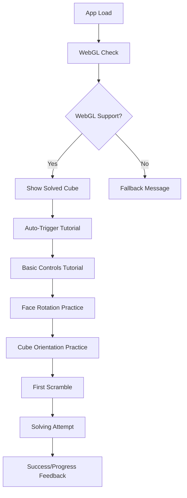
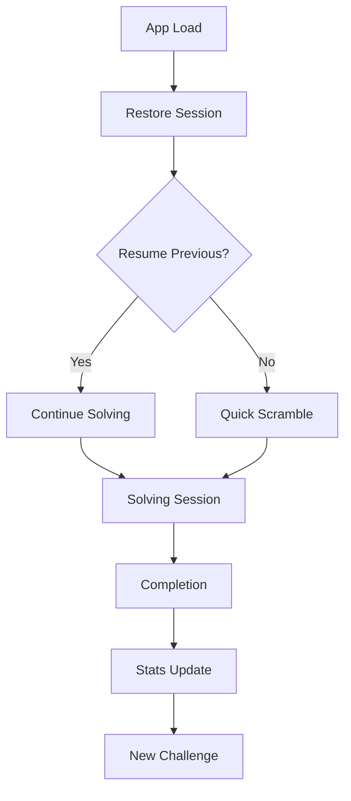
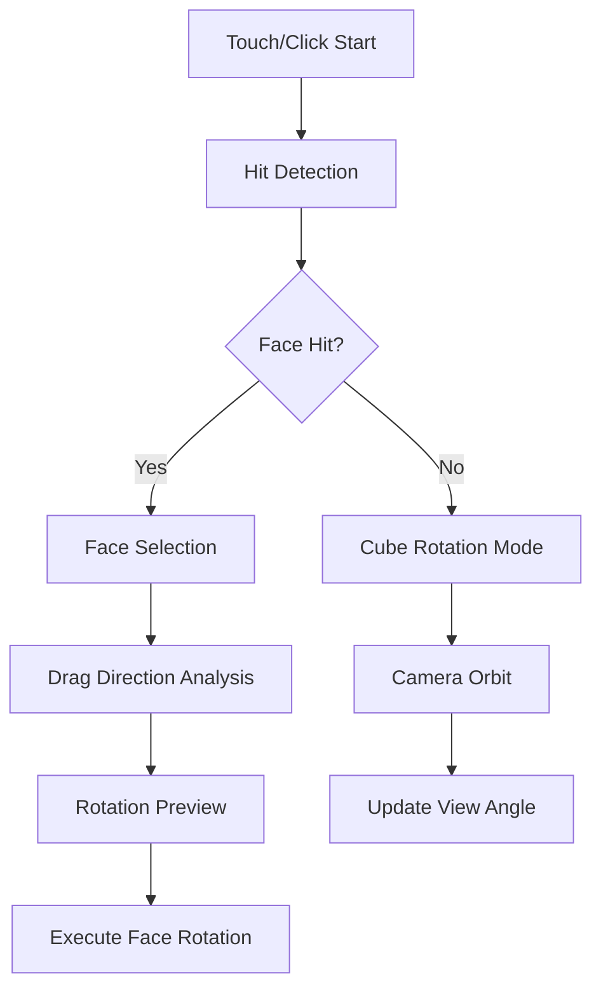

# 3. User Flow Architecture

## Primary User Journey: First-Time Experience

```mermaid
flowchart TD
    A[App Load] --> B[WebGL Check]
    B --> C{WebGL Support?}
    C -->|Yes| D[Show Solved Cube]
    C -->|No| E[Fallback Message]
    D --> F[Auto-Trigger Tutorial]
    F --> G[Basic Controls Tutorial]
    G --> H[Face Rotation Practice]
    H --> I[Cube Orientation Practice]
    I --> J[First Scramble]
    J --> K[Solving Attempt]
    K --> L[Success/Progress Feedback]
```

## Secondary Flow: Expert User Session

```mermaid
flowchart TD
    A[App Load] --> B[Restore Session]
    B --> C{Resume Previous?}
    C -->|Yes| D[Continue Solving]
    C -->|No| E[Quick Scramble]
    D --> F[Solving Session]
    E --> F
    F --> G[Completion]
    G --> H[Stats Update]
    H --> I[New Challenge]
```

## Gesture Recognition Flow

```mermaid
flowchart TD
    A[Touch/Click Start] --> B[Hit Detection]
    B --> C{Face Hit?}
    C -->|Yes| D[Face Selection]
    C -->|No| E[Cube Rotation Mode]
    D --> F[Drag Direction Analysis]
    F --> G[Rotation Preview]
    G --> H[Execute Face Rotation]
    E --> I[Camera Orbit]
    I --> J[Update View Angle]
```
